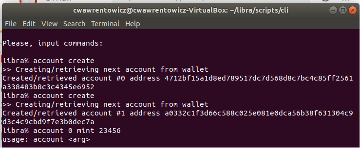

# Pierwsza transakcja przy użyciu kryptowaluty Libra

Organizacja The Libra Association udostępniła Libra Blockchain (łańcuch bloków Libra) o nazwie TestNet,   Pozwala on na wykonanie testowych transakcji przy wykorzystaniu narzędzia CLI (command line interface ). Dokładny sposób  instalacji CLI (obecnie obsługiwane są tylko systemy operacyjne Linux i macOS) został  opisany pod adresem https://developers.libra.org/docs/my-first-transaction. 

Poleceniem **account create** tworzy nowy portfel
 
>libra% account create
>\>\>Creating/retrieving next account from wallet
>Ceated/retrieved account #0 address 4712bf15a1d8ed789517dc7d568d8c7bc4c85ff2561a338483b8c3c4345e6952

>libra% account create
>\>\> Creating/retrieving next account from wallet
>Created/retrieved account #1 address a0332c1f3d66c588c025e081e0dca56b38f631304c9d3c4c9cbd9f7e3b0dec7a

W powyższym przykładzie utworzono dwa portfele. Podczas transakcji można posługiwać się  pełnym adresem portfela lub jego numerem (tu odpowiednio 0 i 1). 

>libra% account 0 mint 23456
>usage: account \<arg\>

